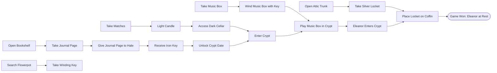

# Manor Content & Puzzle Dependency Map

> Auto-generated from `content/house.json` by `scripts/gen-content-doc.ts`.

## 1. Room Map

```mermaid
graph TD
  foyer["The Foyer"] ---|north| library["The Library"]
  foyer["The Foyer"] ---|east| kitchen["The Kitchen"]
  foyer["The Foyer"] ---|up| nursery["The Nursery"]
  library["The Library"] ---|west| conservatory["The Conservatory"]
  kitchen["The Kitchen"] ---|down [Req: candle_lit]| cellar["The Cellar"]
  cellar["The Cellar"] ---|north [Locked: iron_key]| crypt["The Crypt"]
  nursery["The Nursery"] ---|up| attic["The Attic"]
```

## 2. Items

| ID | Name | Takeable | Movable | Stealable | Notes |
|---|---|---|---|---|---|
| `candle` | candle | ✓ | ✗ | ✗ | Light source (30 turns) |
| `matches` | matches | ✓ | ✓ | ✗ | - |
| `salt` | salt | ✓ | ✗ | ✗ | - |
| `journal_page` | journal page | ✓ | ✓ | ✗ | - |
| `iron_key` | iron key | ✓ | ✗ | ✓ | - |
| `music_box` | music box | ✓ | ✓ | ✗ | - |
| `winding_key` | winding key | ✓ | ✓ | ✗ | - |
| `silver_locket` | silver locket | ✓ | ✓ | ✓ | - |

## 3. Puzzle Dependency Chain



## 4. Canonical Walkthrough (26 Turns)

1. `go north` (Library)
2. `take matches`
3. `open bookshelf`
4. `take journal page`
5. `go west` (Conservatory)
6. `take winding key`
7. `go east`
8. `go south` (Foyer)
9. `give journal page to hale` (Receives Iron Key)
10. `go east` (Kitchen)
11. `take candle`
12. `light candle` (Candle lit for 30 turns)
13. `go west`
14. `go up` (Nursery)
15. `take music box`
16. `wind music box`
17. `go up` (Attic)
18. `open trunk`
19. `take locket`
20. `go down`
21. `go down` (Foyer)
22. `go east` (Kitchen)
23. `go down` (Cellar, lit)
24. `go north` (Crypt, gate unlocked with iron key)
25. `use music box` (Eleanor called to crypt)
26. `place locket on coffin` (Eleanor at rest - WIN)
